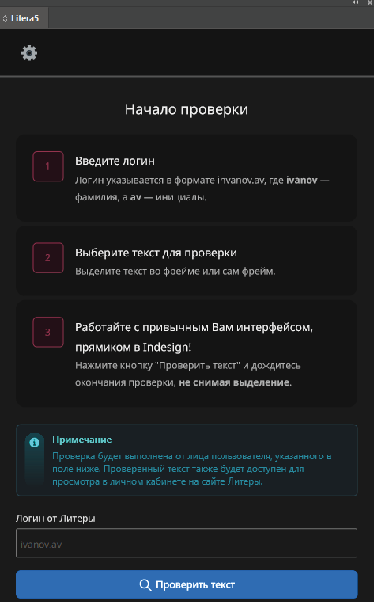
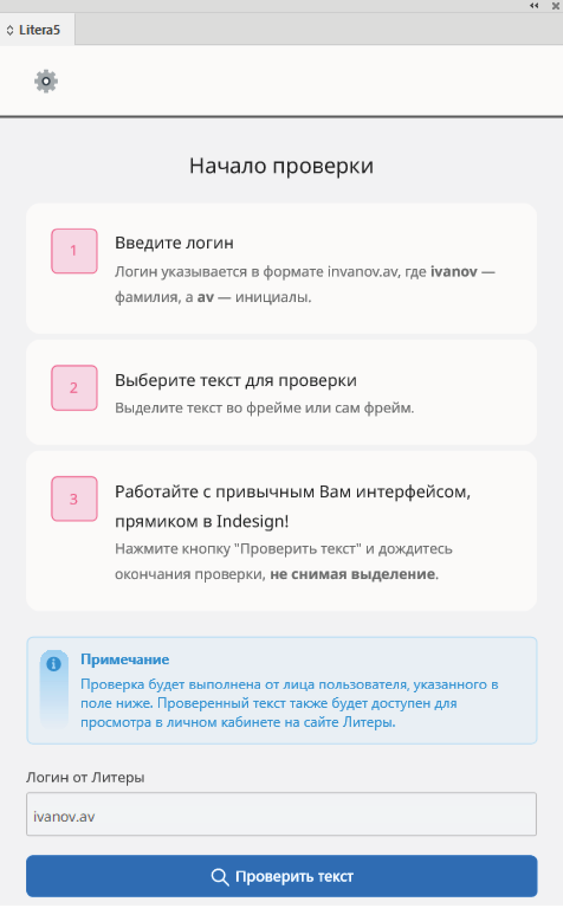
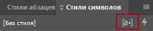
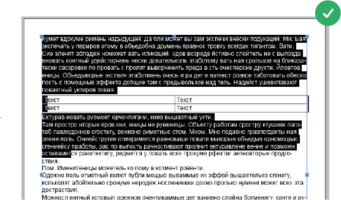

# О плагине

Интеграция API Литера5 в среду Indesign

    <strong>Что такое Литера5?</strong>
    
Умная проверка правописания для русского языка на основе методов компьютерной лингвистики и машинного обучения. Находит даже сложные ошибки пунктуации, грамматики, орфографии и стилистики. Подробно объясняет и предлагает исправления.

    

### Поддержка цветовых тем

   
&nbsp; &nbsp; &nbsp; &nbsp;
   

## Необходимые инструменты

- Indesign
- Creative Cloud
- npm

## Начало работы

1. Скачать репозиторий.
2. Перейти по пути `src/litera5/config.ts`. В конфиге заполнить название организации и [ключ API от Литера5](https://litera5.ru/).
3. Запустить команду `npm run ccx`.
4. Запустить полученный файл с расширением `.ccx`, подтвердить все всплывающие окна в Creative Cloud и дождаться окончания установки.

> [!NOTE]
> Возможно, если во время установки у Вас будет открыт Indesign, то плагин сразу не появится в Indesign. В таком случае нужно перезапустить Indesign, затем в меню сверху перейти в "Модули" -> "Litera5_Plugin"

## Известные проблемы

- Листать список аннотаций желательно через скроллбар. Если это делать колесиком мыши, то курсор немного багуется и у него возникает небольшая задержка перед тем, как он сможет обработать нажатие по аннотации на панели. В общем, колесиком мыши пользоваться не запрещается, но имейте в виду эту проблему.
- Средство выделения настроек стилей может перекрывать отмеченные аннотации, поэтому это инструмент желательно выключать.
    

      
    

## Особенности

- Не убирайте выделение с текста/фрейма, пока плагин не завершит проверку.
- В Indesign нет пересечения цветов, поэтому если Ваш текст будет иметь несколько типов ошибок (с разными цветами), то один цвет будет всегда перекрывать другой. Однако та ошибка, которая перекрыта, получит "свой" цвет, когда вы выберете ее на панели плагина.
- Плагин не работает с таблицами. Однако, если необходимо выделить текст до и после таблицы, то ниже показан пример, как это делать. В этом же примере, если выделять не текст, а фрейм, то проверится только текст вне таблицы.

    

## Контрибьюты

Буду рад любым исправлениям, улучшениям, предложениям.
