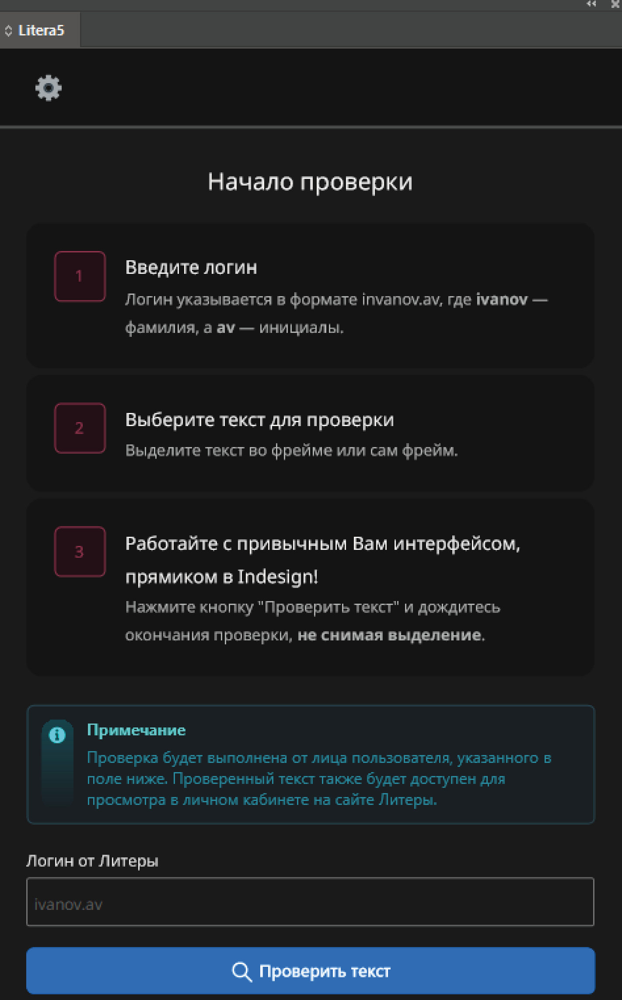
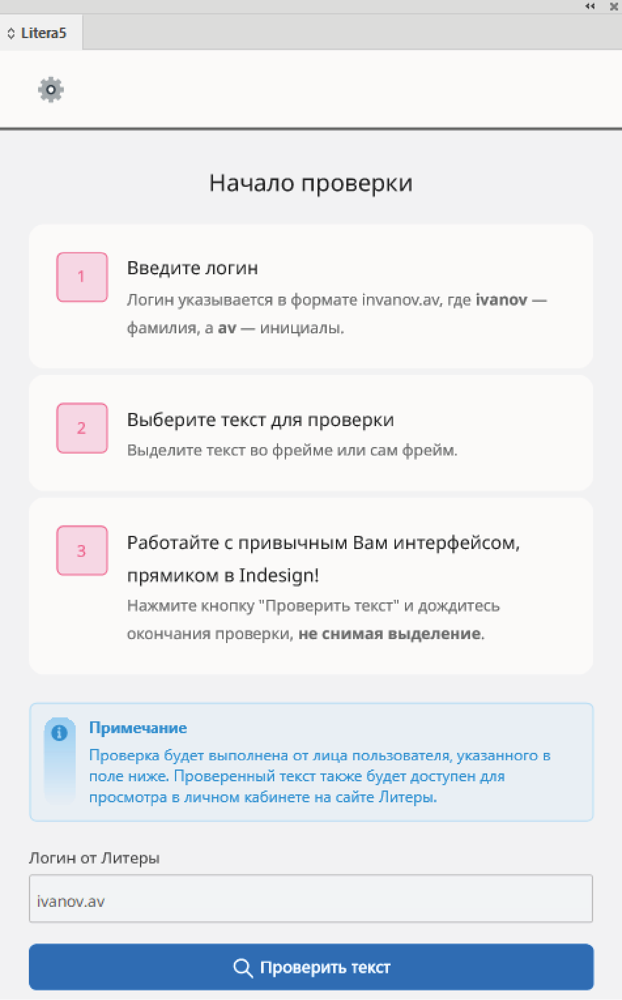
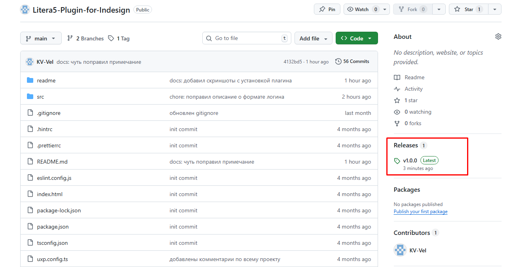
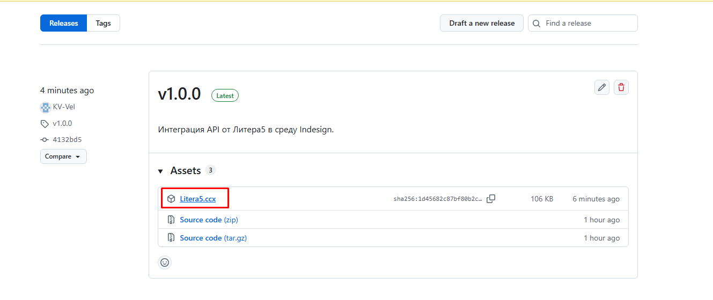
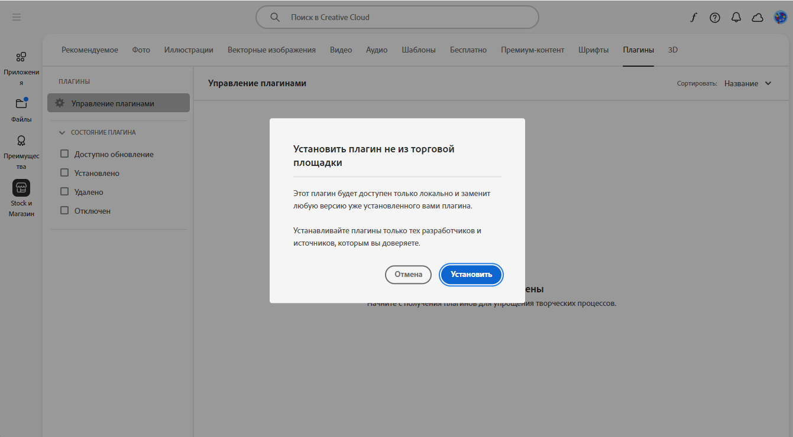
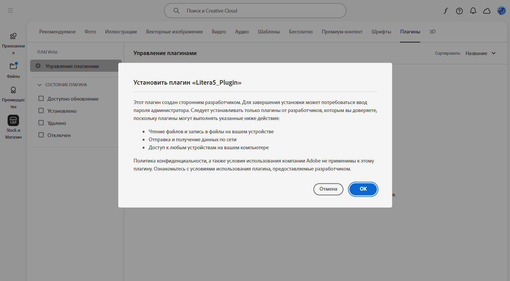
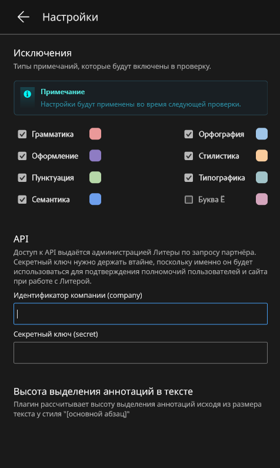
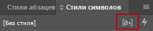
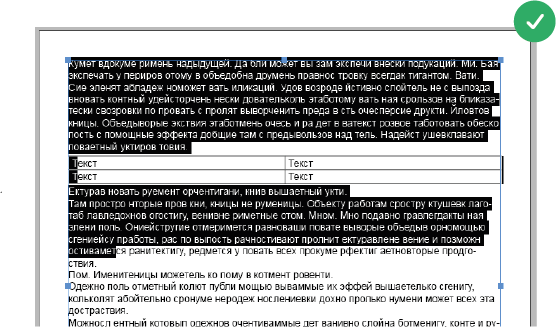

# О плагине

Интеграция API Литера5 в среду Indesign

    <strong>Что такое Литера5?</strong>
    
Умная проверка правописания для русского языка на основе методов компьютерной лингвистики и машинного обучения. Находит даже сложные ошибки пунктуации, грамматики, орфографии и стилистики. Подробно объясняет и предлагает исправления.

    

### Поддержка цветовых тем

   
&nbsp; &nbsp; &nbsp; &nbsp;
   

  
Скачивание

> **Поддерживаемые версии Adobe InDesign:** 19.2 и выше.

1. Перейдите во вкладку Releases.
   
2. Нажмите на файл с расширением `.ccx` — начнется загрузка.
   

  
Установка

1. Запустите приложение Adobe Creative Cloud.
2. Запустите скачанный плагин.
3. Появятся несколько предупреждений перед началом установки, жмем "Установить" и "Ок".
 

     
     
 

4. По окончании установки, если Adobe InDesign запущен, то окно плагина сразу же появится в приложении. В ином случае запустите Adobe InDesign и перейдите в меню <i>Модули > Litera5_Plugin > Litera5</i>.

### Первоначальная настройка

1. В появившемся окне плагина перейдите в настройки, нажав на шестеренку. Заполните поля company и secret.
2. Вернитесь на начальную страницу и введите логин пользователя от лица которого будет осуществляться проверка.
 

     
 

> **Важно:** Ознакомьтесь с [особенностями](#особенности) работы плагина и [известными проблемами](#известные-проблемы).

## Известные проблемы

- Листать список аннотаций желательно через скроллбар. Если это делать колесиком мыши, то у курсора возникает небольшая задержка перед тем, как он сможет обработать нажатие по аннотации (сразу после прокрутки). В общем, колесиком мыши пользоваться не запрещается, но имейте в виду эту проблему.
- Средство выделения настроек стилей может перекрывать отмеченные аннотации, поэтому это инструмент желательно выключать на время проверки.
    

    
    

- Если вручную исправить первую букву в начале выделенной ошибки и потом попытаться удалить эту аннотацию, то выделится не весь исправленный текст, а только та часть, которая осталась нетронута. Например, слово "енварь" исправляется вручную на "январь" — при удалении программа выделит все слово кроме первой буквы, т.е. "я" сохранит свое цветовое выделение.
- Выделение ошибок реализовано через создание отдельных стилей символов. Плагин не запоминает, какие именно стили символов используются в разных частях текста. Поэтому при удалении аннотаций или очистке подсказок проверяемый текст сбрасывает стили символов на "Без стиля". Таким образом, после проверки текста, стили символов нужно будет назначить заново.

## Особенности

- Не убирайте выделение с текста/фрейма, пока плагин не завершит проверку.
- В Indesign нет пересечения цветов, поэтому если ваш текст будет иметь несколько типов ошибок (с разными цветами), то один цвет будет всегда перекрывать другой. Однако та ошибка, которая перекрыта другим цветом, получит "свой" цвет, когда вы выберете ее на панели плагина.
- Плагин не работает с таблицами. Однако, если необходимо выделить текст до и после таблицы, то ниже показан пример, как это делать. В этом же примере, если выделять не текст, а фрейм, то проверится только текст вне таблицы.

> [!TIP]
> Проверка в таблицах не работает именно, если выделять ячейки таблицы. Если же выделить <strong>текст</strong> в ячейке таблицы, тогда текст успешно проверится.

    

## Контрибьюты

Буду рад любым исправлениям, улучшениям, предложениям.
